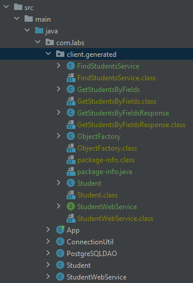

# Краткое описание

Для запуска проекта необходимо скачать и распаковать файлы из данного репозитория, либо скачать только jar-файл из корня 
проекта.

## База данных PostgreSQL

Необходимо заранее подготовить базу данных. Если требуется подключить базу данных с отличными от установленных по 
умолчанию параметрами, то необходимо изменить в классе com.labs.ConnectionUtil константы, в частности:

```java
private static final String JDBC_URL = "jdbc:postgresql://localhost:5432/ws_students_db";
private static final String JDBC_USER = "postgres";
public static final String JDBC_PASSWORD = System.getenv("JDBC_PASSWORD");
```

При изменении в первой строке имени БД, потребуется дополнительно внести соответствующие правки. 
Как видно из представленного выше кода, значение пароля берется из переменной окружения JDBC_PASSWORD, которую также 
потребуется задать.

## Запуск проекта

Рекомендуется запускать проект из jar-файла, т.к. это наиболее удобный метод. Для запуска необходимо перейти в 
директорию проекта и выполнить команду:
```shell
# запуск сервиса
java -jar lab1_standalone_ws.jar
# не закрывать консоль с сервисом (для закрытия сервиса использовать, например, Ctrl+C), 
# а в новом терминале выполнить команду для запуска клиента
java -jar lab1_client.jar
# если проблемы с выводом кириллицы в консоли при запуске jar-файла, то стоит указать флаг
java -jar -Dfile.encoding=UTF-8 lab1_client.jar
```

---

# Подробное описание хода работы

## Подготовка окружения

Всё окружение было установлено на Windows 10, данные релиза представлены на рисунке ниже.


​     В качестве системы контроля версий использован Git и платформа GitHub. Ключ SSH создан через утилиту PuTTYgen и добавлен в настройки аккаунта GitHub. Для подключения используется OpenSSH Client, предустановленный в Windows.

​     Для работы с Java был установлен OpenJDK от Amazon Corretto 8 (jdk 1.8). Скачан соответствующий архив, распакован и добавлены переменные окружения Path и JAVA_HOME. Вывод версии представлен ниже.


 

## Среда разработки

Выполним настройку окружения для разработки. Будем использовать среду разработки Intellij IDEA, скриншот окна About представлен на рисунке ниже.


​     В редакторе установлены переводы строк LF.

 

## Сборщик проектов

​     Для сборки проектов используется Maven. Для установки был скачан архив с бинарными файлами по ссылке:

http://maven.apache.org/download.cgi

Архив был распакован и в переменную окружения Path был добавлен путь к поддиректории bin. Для сборки проекта возможно использовать команду mvn package, либо собирать при помощи среды разработки.

 

## База данных

Также был установлен сервер PostgreSQL и клиент pgAdmin при помощи файла-установки, скачанного по ссылке 

https://www.enterprisedb.com/downloads/postgres-postgresql-downloads   

Версия: 13.3

Для взаимодействия использован JDBC драйвер, скачанный по ссылке:

https://jdbc.postgresql.org/download.html

jar файл драйвера был также добавлен в директорию сервера приложений Glassfish.

 

## Сервер приложений Glassfish

Сервер приложений был установлен в комплекте с Java2EE SDK, скачанном по ссылке:

https://www.oracle.com/java/technologies/java-ee-sdk-7-jdk-7u21-downloads.html

Запуск с указанием пути к jdk из консоли:

```shell
cd C:\Users\<UserName>\Downloads

ogs-<3.1.2.x>-windows.exe -j "<path/to/jdk/folder>"
```

Далее проходила стандартная установка. Порты и домен оставлены по умолчанию. 

·    Домен: domain1

·    Сервер приложений: http://localhost:8080

·    Консоль администрирования: http://localhost:4848

Управление сервером приложений производилось из среды разработки Intellij IDEA указанием соответствующей конфигурации проекта. Для подключения PostgreSQL, как ранее было указано, был скачан jar файл с JDBC драйвером для PostgreSQL и добавлен в директорию glassfish_dir/glassfish/lib. После этого в консоли администратора по адресу localhost:4848 выполнена настройка JDBC > JDBC Connection Pools, где создан новый Pool.


 Затем был также настроен JDBC ресурс и указаны параметры подключения.


Для внедрения зависимости используется JNDI имя: jdbc/ws

Конфигурация среды разработки для сборки Java2EE сервиса:


## Разработка standalone-сервиса

Ход работы:

1. Создать таблицу в БД, содержащую не менее 5 полей. То есть в таблице должно быть 5 и более столбцов. Используем источник данных в Intellij IDEA и настроим подключение через пользователя postgres для создания новой БД:


После подключения нам будет доступна консоль и схема БД. В консоли прописываем SQL для создания требуемой базы данных и таблицы.

Будем использовать поля: имя (name), фамилия (surname), возраст (age), номер студента (student_id) и оценка (mark). Номер студента будет представлен целым числом из шести цифр, оценка будет представлена в текстовом виде: «неудовлетворительно», «удовлетворительно», «хорошо», «отлично». Создадим 7 записей. Базу данных назовём ws_students_db, а таблицу – students. В итоге получаем следующий код для создания базы данных и таблицы.


Далее добавляем конфигурацию JDBC драйвера:


 

Создаем классы App, ConnectionUtil, PostgreSQLDAO, Student, StudentWebService по аналогии с классами, описанными в методическом пособии. В качестве вызываемого метода используем getAllStudents, который будет возвращать все данные из БД:


В итоге проверяем вывод данных из БД через SoapUI


 

2. Реализовать возможность поиска по любым комбинациям полей с помощью SOAP-сервиса. Данные для поиска должны передаваться в метод сервиса в качестве аргументов.

​     В соответствии с заданием, при запросе клиент указывает метод и набор его аргументов, которые являются данными для поиска. По набору аргументов производится поиск записей в базе данных, т.е. если аргумент соответствует какому-либо полю, то в ответе необходимо предоставить данные записи с подобным полем. При передаче нескольких аргументов они могут относиться как к различным полям одной записи, так и к полям различных записей, либо не относиться ни к одной записи в БД. В каждом случае необходимо вернуть список записей (без повторений), которые удалось найти по переданным в аргументах полям.

Ввиду того, что значения в БД могут иметь различный тип данных, стоит использовать приведение к тексту в PostgreSQL, для чего можно построить следующий запрос:

```sql
SELECT t.* FROM students t WHERE (t.*)::text LIKE '%someField%'
```

​     Данный запрос позволит вернуть любую строку, в которой поле содержит значение someField, причем независимо от типа данных.

Соответствующим образом изменим изначальный код, для чего в класс StudentWebService добавим получение параметра с наименованием studentName:

```java
package com.labs;

import javax.jws.WebMethod;
import javax.jws.WebParam;
import javax.jws.WebService;
import java.util.List;

@WebService(serviceName = "GetAllStudentsService")
public class StudentWebService {
    @WebMethod(operationName = "getAllStudents")
    public List<Student> getAllStudents(@WebParam(name = "studentName") String studentName) {
        PostgreSQLDAO dao = new PostgreSQLDAO();
        return dao.getAllStudents(studentName);
    }
}
```

В классе PostgreSQLDAO необходимо указать аргумент метода getAllStudents (String studentName), и изменить строку запроса к БД:

```java
ResultSet rs = stmt.executeQuery("SELECT t.* FROM students t WHERE (t.*)::text LIKE '%" + studentName + "%'");
```

То есть теперь клиент должен указать значение аргумента, по которому мы произведем поиск записей в БД. Попробуем запустить сервис и выполнить запрос:


 

В задании требуется передавать несколько аргументов, по которым в итоге будет производиться поиск.

 Изменим класс StudentWebService, чтобы передавать на вход массив аргументов для поиска:

```java
@WebService(serviceName = "FindStudentsService")
public class StudentWebService {
    @WebMethod(operationName = "getStudentsByFields")
    public List<Student> getStudentsByFields(@WebParam(name = "fieldValue") String[] searchArgs) {
        PostgreSQLDAO dao = new PostgreSQLDAO();
        return dao.getStudentsByFields(searchArgs);
    }
}

```

Мы также указали наиболее подходящие наименования для сервиса и метода. В классе PostgreSQLDAO получаем на вход массив аргументов для поиска. Затем в стандартном цикле for перебираем аргументы один за другим и выполняем по каждому из них выборку из базы данных, результаты также добавляем в список students, который затем будет возвращен в качестве результата. Теперь есть возможность передавать несколько аргументов для поиска, причем если аргумент совпадает с одним из полей в таблице БД, то будет возвращена соответствующая запись. Однако еще не учтены случаи, когда передаются различные аргументы, которые совпадают с полями одной записи (возвращается дубликат), а также можно повторно передавать один аргумент и получать дубликаты для одной записи. 


 

 Чтобы убрать дубликаты при возврате стоит для класса Student переопределить методы hashcode() и equals(), а затем использовать структуру данных для хранения LinkedHashSet<Student>, которая позволит сохранить объекты в порядке их добавления, но оставит только уникальные сущности. Если метод hashcode() для двух объектов возвращает разные значения, то объекты не совпадают, т.е. являются уникальными и мы их должны вернуть в ответе на запрос. Переопределить hashcode() можно как с использованием только поля student_id, считая, что подобный идентификатор будет уникальным, но можно использовать все поля при подсчете значения, для случаев, когда student_id может быть неуникальным, например, если в записях таблицы есть студенты из различных вузов с одинаковыми идентификаторами и т.п.

```java
    @Override
    public int hashCode() {
        final int prime = 31;
        int result = 1;
        result = prime * result + student_id;
        result = prime * result + age;
        result = prime * result + ((name == null) ? 0 : name.hashCode());
        result = prime * result + ((surname == null) ? 0 : surname.hashCode());
        result = prime * result + ((mark == null) ? 0 : mark.hashCode());

        return result;
    }
```


Теперь переопределим equals():

```java
    @Override
    public boolean equals(Object obj) {
        if (obj == this) {
            return true;
        }
        if (obj == null || obj.getClass() != this.getClass()) {
            return false;
        }

        Student guest = (Student) obj;
        return student_id == guest.student_id && age == guest.age
                && (name == guest.name || (name != null &&name.equals(guest.getName())))
                && (surname == guest.surname || (surname != null && surname .equals(guest.getSurname())))
                && (mark == guest.mark || (mark != null && mark .equals(guest.getMark())));
    }
```

Переопределив методы используем структуру данных LinkedHashSet. Теперь мы учитываем наличие дублирующих значений полей в запросе клиента и выдаем соответствующий результат, т.е. уникальные записи из БД, в которых содержатся переданные для поиска значения в различных комбинациях:


Пример запроса клиента:

```xml
<soapenv:Envelope xmlns:soapenv="http://schemas.xmlsoap.org/soap/envelope/">
   <soapenv:Header/>
   <soapenv:Body>
      <ws:getStudentsByFields xmlns:ws="http://labs.com/">
      	<fieldValue>28</fieldValue>
      	<fieldValue>26</fieldValue>
      	<fieldValue>Кант</fieldValue>
      	<fieldValue>Кцйкант</fieldValue>
      </ws:getStudentsByFields>
   </soapenv:Body>
</soapenv:Envelope>
```

# Консольный клиент

Генерируем из WSDL описания сервиса соответствующие классы:

```java
cd src/main/java
wsimport -keep -p com.labs.client.generated http://localhost:8080/FindStudentsService?wsdl
```




И затем потребуется основной класс для приложения-клиента com.labs.client.WebServiceClient:

```java
public class WebServiceClient {
    public static void main(String[] args) throws MalformedURLException {
        URL url = new URL("http://localhost:8080/FindStudentsService?wsdl");
        FindStudentsService studentService = new FindStudentsService(url);

        List<String> given_args = new ArrayList<String>();

        given_args.add("26");
        given_args.add("28");

        List<Student> students = studentService.getStudentWebServicePort().getStudentsByFields(given_args);
        for (Student student : students) {
            System.out.println("Student: " + "name=" + student.getName() + ", surname=" + student.getSurname() +
                    ", age=" + student.getAge() + ", student_id=" + student.getStudentId() + ", mark=" +
                    student.getMark() + ";");
        }
    }
}
```

В данном случае мы формируем массив аргументов для поиска и передаем их в соответствующий метод, который был 
сгенерирован вместе с классом из WSDL-описания сервиса.

Теперь необходимо получать массив аргументов из консоли при обращении к клиенту, а на вывод подавать найденные 
в БД записи. Добавим соответствующим метод:

```java
    private static List<String> getArgs() {
        List<String> given_args = new ArrayList<String>();

        // Консольный ввод аргументов
        Scanner scanner = new Scanner(System.in);
        System.out.println("Input argument for search (one line = one argument, input 'exit' for exit): ");
        String given_arg;
        do {
            given_arg = scanner.nextLine();
            // проверим строку на наличие аргумента: если строка не является пустой и не состоит из пробелов, то
            // добавляем аргумент в массив
            if (given_arg != null && !given_arg.trim().isEmpty()) {
                given_args.add(given_arg);
            }
            System.out.print(" [Input 'exit' for exit]");
        } while (!given_arg.equals("exit"));

        return given_args;
    }
```